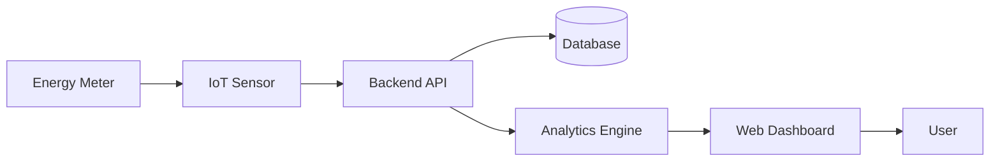

# ⚡ Smart Energy Monitoring System

<div align="center">


A modern IoT-based platform for monitoring, analyzing, and visualizing real-time energy consumption.

</div>

---

## 📖 Overview

The Smart Energy Monitoring System collects electricity usage data from smart devices or sensors, processes it in real time, and presents interactive dashboards for users. The system helps reduce electricity waste by providing usage analytics and alerts.

---

## ✨ Features

- ⚡ Real-time energy monitoring
- 📊 Interactive dashboard
- 📈 Daily, weekly and monthly reports
- 🔔 High energy consumption alerts
- 🌐 IoT device integration
- 📱 Responsive web interface
- 🔐 Secure authentication

---

## 🏗️ System Architecture



---

## 📊 Dashboard

- Live Power Consumption
- Voltage Monitoring
- Current Monitoring
- Energy Analytics
- Device Status

---

## 🛠️ Technology Stack

| Frontend | Backend | Database | Hardware |
|-----------|----------|----------|----------|
| HTML | Flask / Node.js | MySQL | ESP32 |
| CSS | REST API | MongoDB | Arduino |
| JavaScript | Python | Firebase | Energy Meter |

---

## 📂 Project Structure

```text
Smart-Energy-Monitoring-System/
│
├── frontend/
├── backend/
├── database/
├── images/
├── docs/
├── api/
├── README.md
└── requirements.txt
```

---

## 📷 Screenshots


---

## 🚀 Installation

```bash
git clone https://github.com/yourusername/Smart-Energy-Monitoring-System.git

cd Smart-Energy-Monitoring-System

pip install -r requirements.txt

python app.py
```

---

## 📈 Future Improvements

- AI-based energy prediction
- Solar power integration
- Mobile application
- Smart notifications
- Voice assistant support

---

## 🤝 Contributing

Contributions are welcome!

Fork the repository, create a feature branch, and submit a Pull Request.

---

## 📄 License

This project is licensed under the MIT License.

---

⭐ If you found this project useful, don't forget to star the repository.
